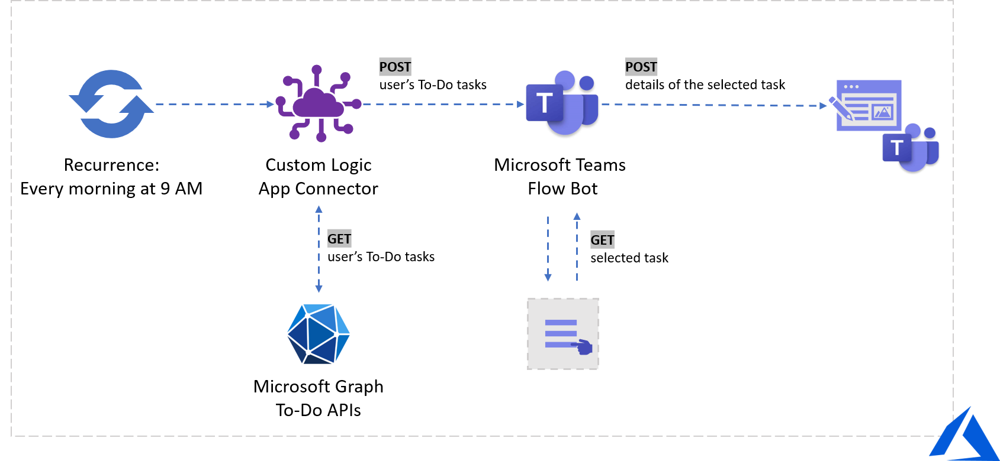

## Get your To-Do tasks ever morning on Microsoft Teams using Azure Logic Apps

I am super excited since [Microsoft Graph To Do APIs](https://docs.microsoft.com/graph/todo-concept-overview?view=graph-rest-beta&WT.mc_id=devto-blog-aycabas) are introduced at Microsoft Build 2020. We finally have APIs available in public preview on the beta endpoint of Graph. 

Just a brief introduction, [Microsoft To Do](https://www.microsoft.com/en-in/microsoft-365/microsoft-to-do-list-app?rtc=1) and [Planner](https://www.microsoft.com/en-us/microsoft-365/business/task-management-software) are the essence of tasks in Microsoft 365. To-Do helps you create a list for anything, from work assignments to school projects to groceries. It is a great tool for your personal use. On the other hand, Planner is the best place to collaborate as a team and keep your team tasks. Tasks come from everywhere, you can keep track of deadlines by adding reminders, due dates, and notes. 

### Wouldn't it be nice to receive your list of assigned tasks every morning on Microsoft Teams? 

Today, we will build a flow using [Azure Logic Apps](https://docs.microsoft.com/azure/logic-apps/?WT.mc_id=devto-blog-aycabas) to automate Microsoft Teams Flow bot for sending To-Do tasks every morning at 9 AM. Here is the steps we will follow:
* Learn the queries and responses about Microsoft Graph To-Do APIs in [Graph Explorer](https://developer.microsoft.com/graph/graph-explorer?WT.mc_id=devto-blog-aycabas)
* Build [Azure Logic Apps Custom Connector](https://docs.microsoft.com/azure/logic-apps/custom-connector-overview?WT.mc_id=devto-blog-aycabas) to consume Graph To-Do API and get the tasks
* Create Logic Apps flow to automate sending tasks from Microsoft Teams Flow bot every morning

#### Microsoft Graph To-Do APIs in Graph Explorer

