# Get your To-Do tasks ever morning on Microsoft Teams using Azure Logic Apps

I am super excited since [Microsoft Graph To Do APIs](https://docs.microsoft.com/graph/todo-concept-overview?view=graph-rest-beta&WT.mc_id=devto-blog-aycabas) are introduced at Microsoft Build 2020. We finally have APIs available in public preview on the beta endpoint of Graph. 

Just a brief introduction, [Microsoft To Do](https://www.microsoft.com/en-in/microsoft-365/microsoft-to-do-list-app?rtc=1) and [Planner](https://www.microsoft.com/en-us/microsoft-365/business/task-management-software) are the essence of tasks in Microsoft 365. To-Do helps you create a list for anything, from work assignments to school projects to groceries. It is a great tool for your personal use. On the other hand, Planner is the best place to collaborate as a team and keep your team tasks. Tasks come from everywhere, you can keep track of deadlines by adding reminders, due dates, and notes. 

## Wouldn't it be nice to receive your list of assigned tasks every morning on Microsoft Teams? 

Today, we will build a flow using [Azure Logic Apps](https://docs.microsoft.com/azure/logic-apps/?WT.mc_id=devto-blog-aycabas) to automate Microsoft Teams Flow bot for sending To-Do tasks every morning at 9 AM. Here is the steps we will follow:
* Learn the queries and responses about Microsoft Graph To-Do APIs in [Graph Explorer](https://developer.microsoft.com/graph/graph-explorer?WT.mc_id=devto-blog-aycabas)
* Register your app in [Azure Active Directory](https://docs.microsoft.com/azure/active-directory/develop/quickstart-register-app?WT.mc_id=devto-blog-aycabas)
* Build [Azure Logic Apps Custom Connector](https://docs.microsoft.com/azure/logic-apps/custom-connector-overview?WT.mc_id=devto-blog-aycabas) to consume Graph To-Do API and get the tasks
* Create Logic Apps flow to automate sending tasks from Microsoft Teams Flow bot every morning

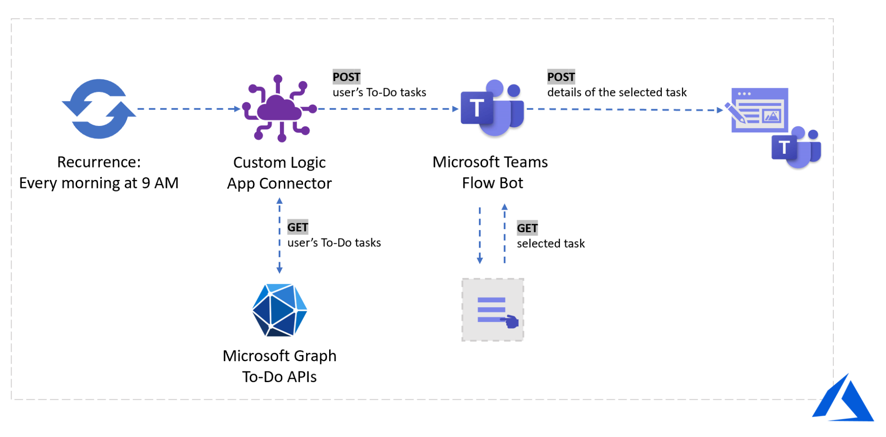

### Microsoft Graph To-Do APIs in Graph Explorer

To be able to review Microsoft Graph To-Do API queries and responses with your own data, go to [Microsoft Graph Explorer](https://developer.microsoft.com/graph/graph-explorer?WT.mc_id=devto-blog-aycabas) and login with your account from the top left corner by clicking **Sign in to Graph Explorer**.

Then, search for "to do" under **Sample queries** and select **Get my to do task list**. This will run the query `https://graph.microsoft.com/beta/me/todo/lists` and will get all the task lists as a response. Copy one of your preferred task list Id from the response.

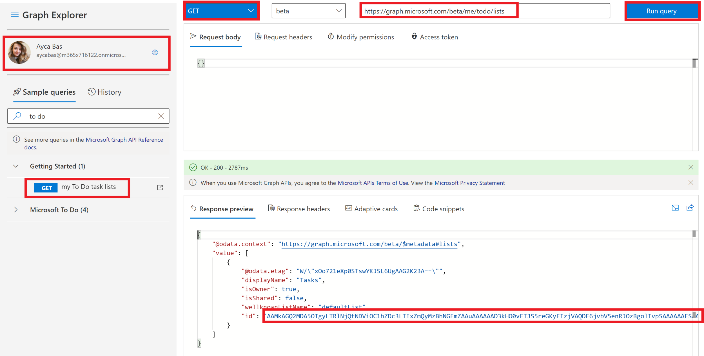

Let's try to get all the tasks under your preferred task list. Change the query with the following: `https://graph.microsoft.com/beta/me/todo/lists/{taskListId}/tasks`. Make sure the request is `GET` and hit `Run query`. You should be able to see all tasks under the selected list as a response.

Copy this query and save somewhere, we will use this later while creating a custom connector.

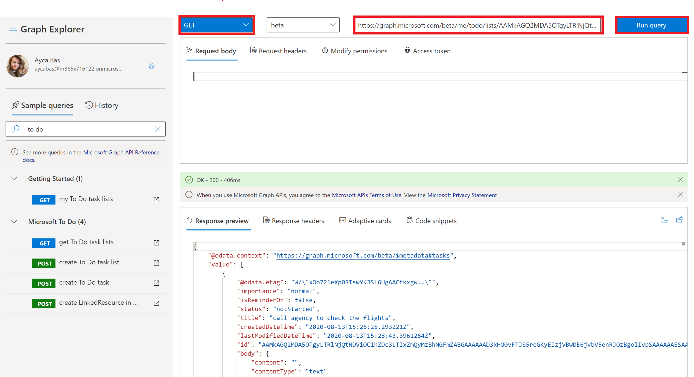

### Register your app in Azure Active Directory

Go to **Azure Active Directory** in [Azure Portal](https://portal.azure.com). Select **App Registrations** and choose **New registation**.

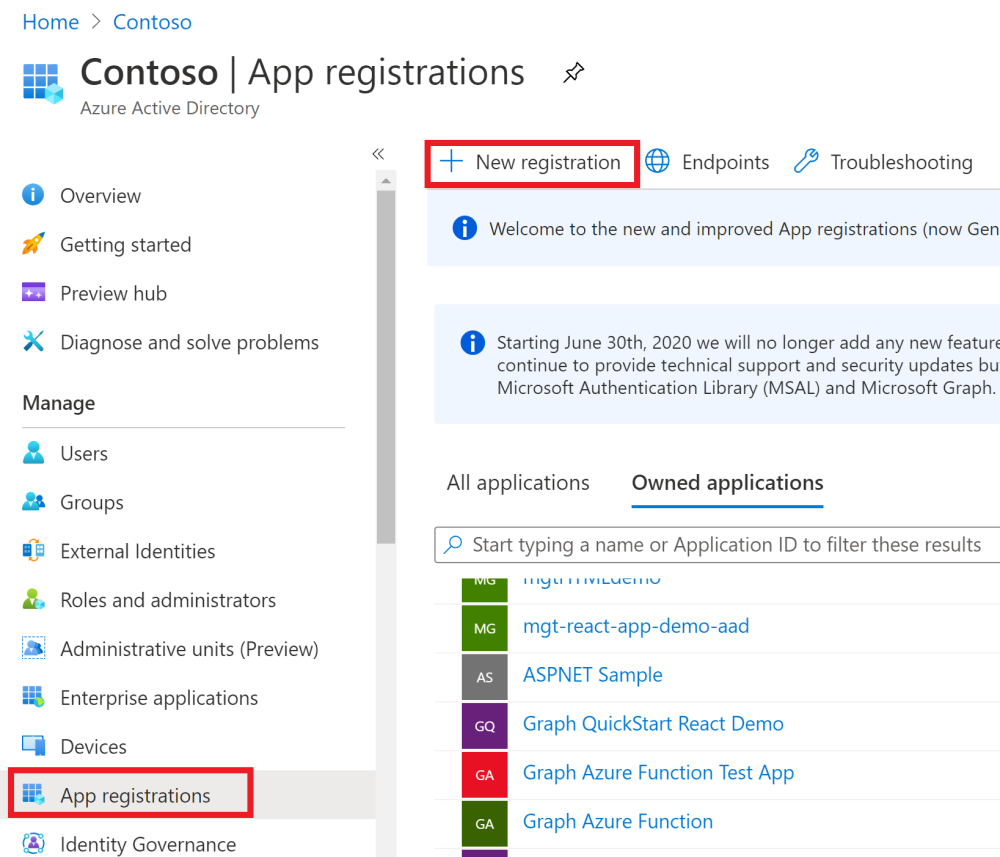

Enter `To-do-flow-app` in the Name field. In the Supported account types section, select **Accounts in any organizational directory and personal Microsoft accounts**. Leave **Redirect URI** blank and choose **Register** to continue.

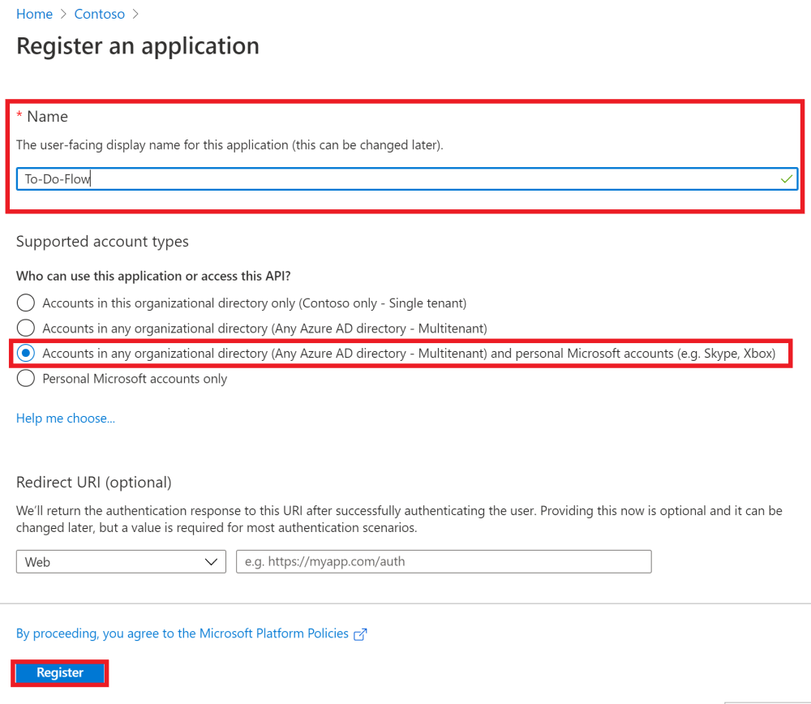

Go to **API permissions** from the left hand side menu and select **add a permission**. Choose **Microsoft Graph** and **Delegated Permissions**. Select `Task.ReadWrite` and click **Add permission** button.

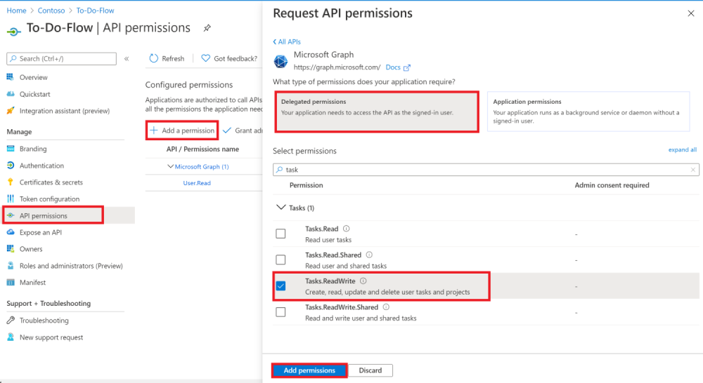

Go to **Certificates & secrets** from the left hand side menu and select **New client secret** under the **Client secrets**. Choose expiry time and **Add**.  

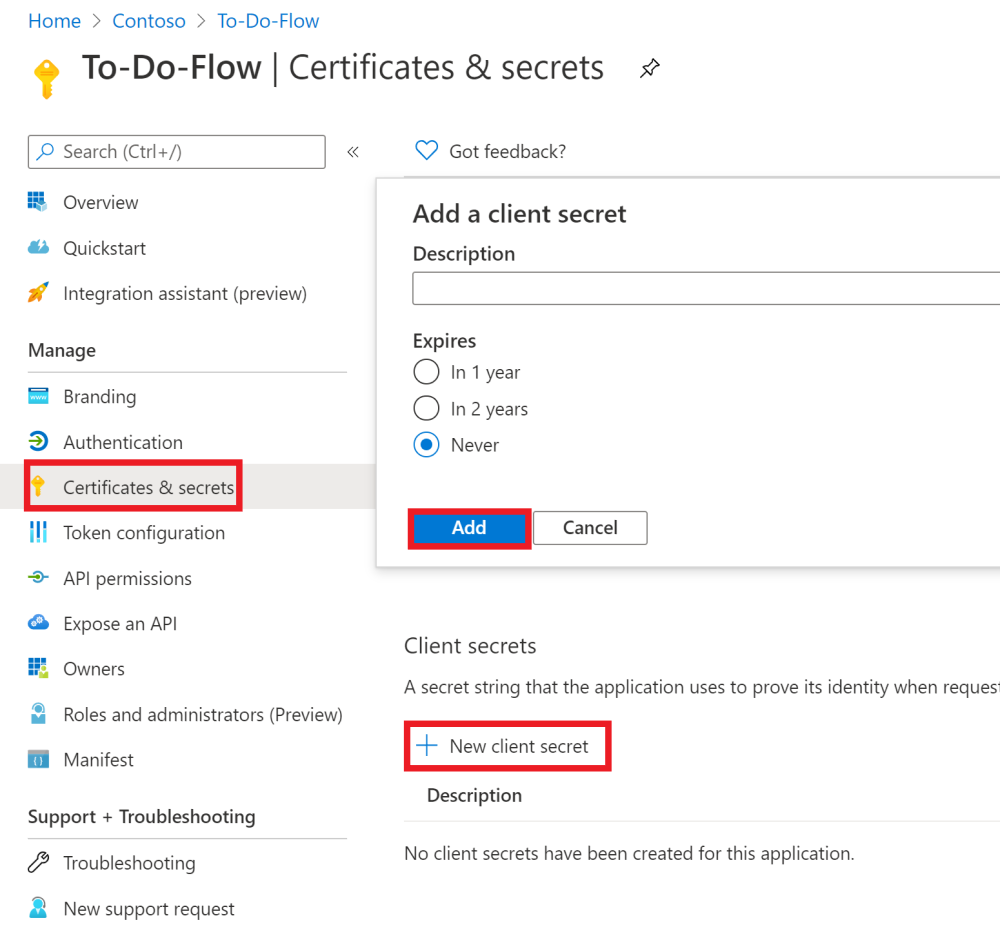

Copy the `secret` you created and `Application Id` under the **Overview** page. Save them somewhere, we will use them while creating a custom connector.

### Build Azure Logic Apps Custom Connector to consume To-Do APIs in a flow

Go to [Azure Portal](https://portal.azure.com) and create [Logic Apps Custom Connector](https://docs.microsoft.com/azure/logic-apps/custom-connector-overview?WT.mc_id=devto-blog-aycabas).

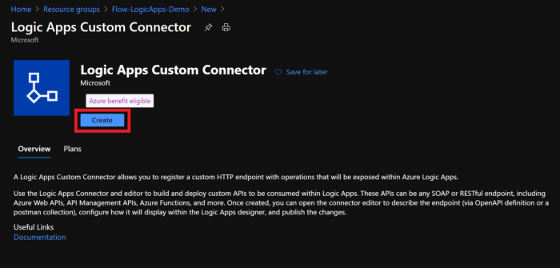

On the connector configuration, fill the fields as follows:
* **Subscription:** Select an Azure subscription
* **Resource Group:** Create new resource group
* **Custom connector name:** give a name for your custom connector
* **Select the location:** `Region`
* **Location:** Select the preferred location

Choose **Review + create** button to continue.

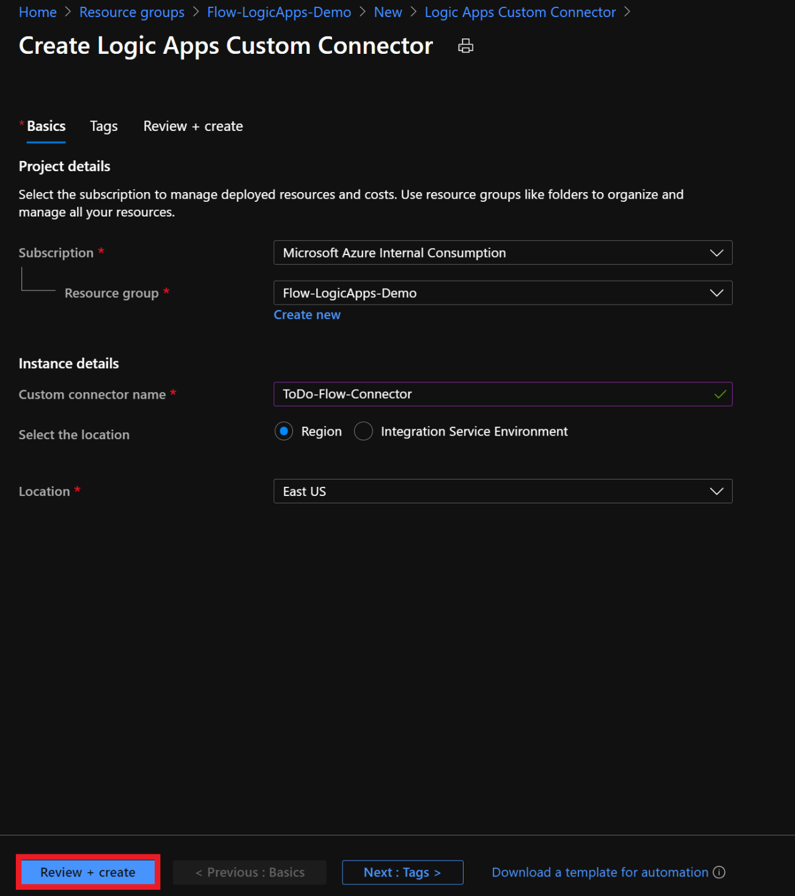

When your custom connector is successfully created, select `Edit` to configure your connector.

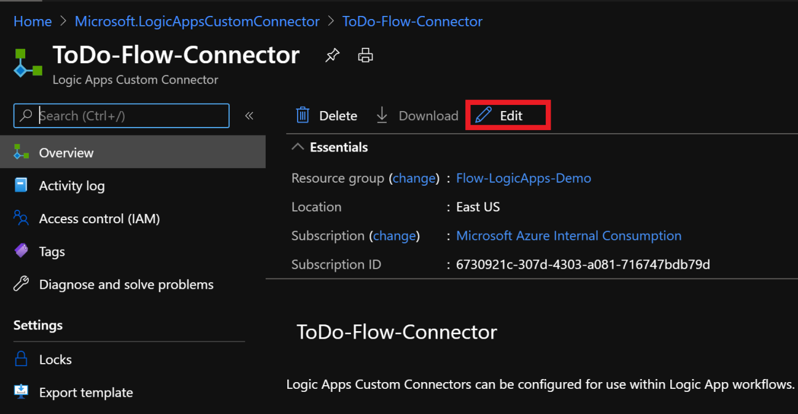

On the connector configuration General page, fill in the fields as follows.

* **Scheme:** HTTPS
* **Host:** `graph.microsoft.com`
* **Base URL:** `/`

Choose **Security** button to continue.

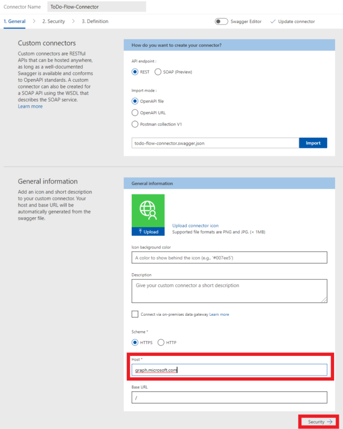

On the **Security** page, fill in the fields as follows.

* **Choose what authentication is implemented by your API:** `OAuth 2.0`
* **Identity Provider:** `Azure Active Directory`
* **Client id:** the application ID you created in the previous exercise
* **Client secret:** the key you created in the previous exercise
* **Login url:** `https://login.windows.net`
* **Tenant ID:** `common`
* **Resource URL:** `https://graph.microsoft.com` (no trailing /)
* **Scope:** Leave blank

Choose **Definition** button to continue.

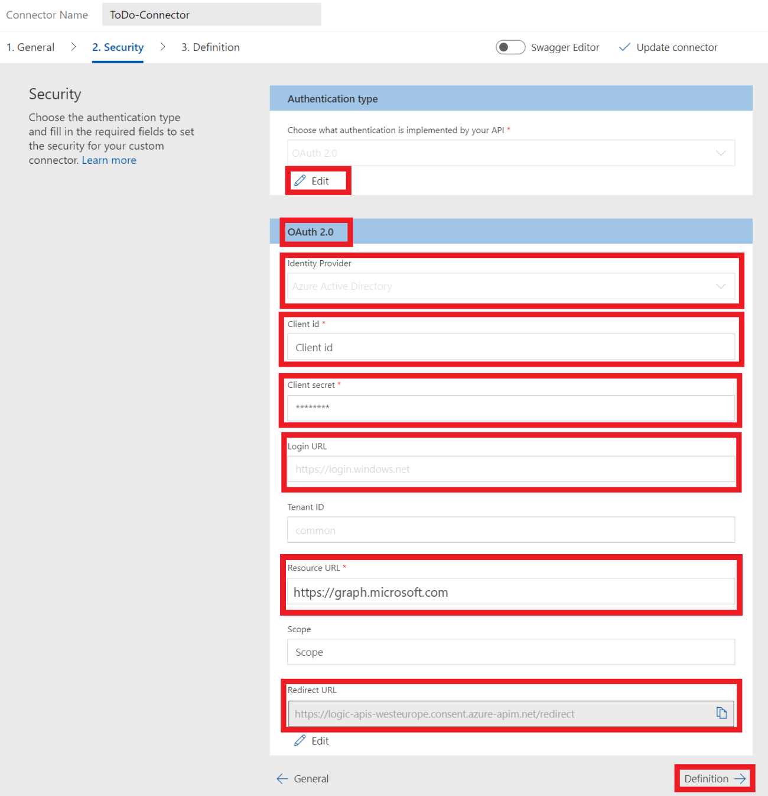

On the **Definition** page, select **New Action** and fill in the fields as follows.

* **Summary:** `Get To-Do Tasks`
* **Description:** `Get To-Do Tasks`
* **Operation ID:** `ToDo`
* **Visibility:** `important`

Create **Request** by selecting **Import from Sample** and fill in the fields as follows.

* **Verb:** `GET`
* **URL: (paste the query you copied from the Graph Explorer)** `https://graph.microsoft.com/beta/me/todo/lists/{taskListId}/tasks`
* **Headers:** Leave blank
* **Body:** leave blank

Select **Import**.

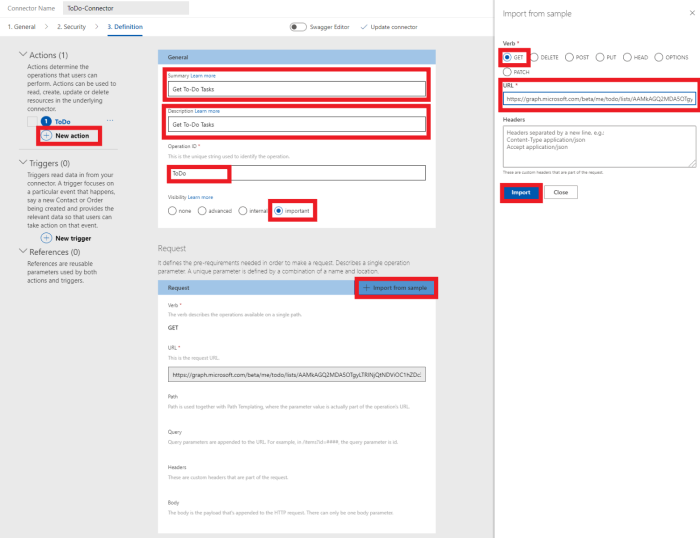

Choose **Create Connector** on the top-right. After the connector has been created, copy the generated **Redirect URL** from **Security** page.

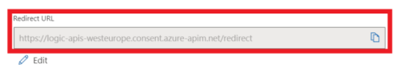

Go back to Azure Active Directory registered app, go to **Authentication tab** and select **Add platform**, choose **Web**.

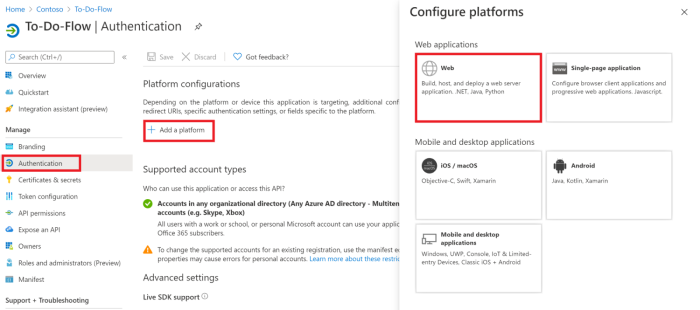

Paste the **Redirect URI** you copied from the custom connector under the **Redirect URIs**. Select `Access tokens` and `Id tokens`. Click **Configure** to continue.

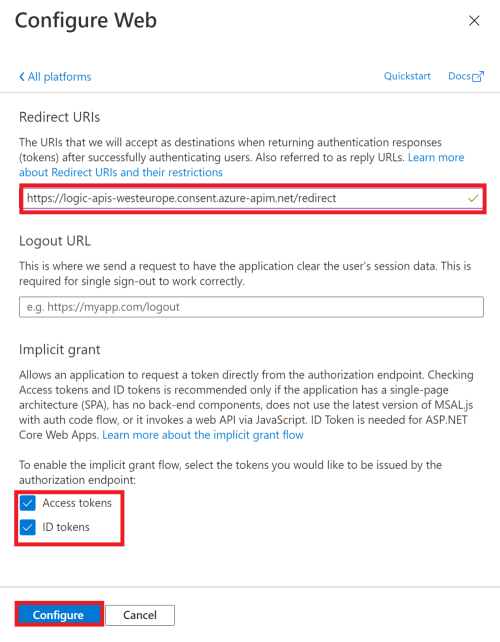

### Create Logic Apps flow to automate receiving To-Do tasks

Go to [Azure Portal](https://portal.azure.com) and create **Logic App**.

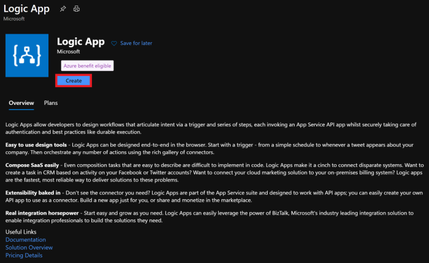

On the configuration page, fill the fields as follows:
* **Subscription:** Select an Azure subscription
* **Resource Group:** Create new resource group
* **Custom connector name:** give a name for your logic app
* **Select the location:** `Region`
* **Location:** Select the preferred location

Choose **Review + create** button to continue.

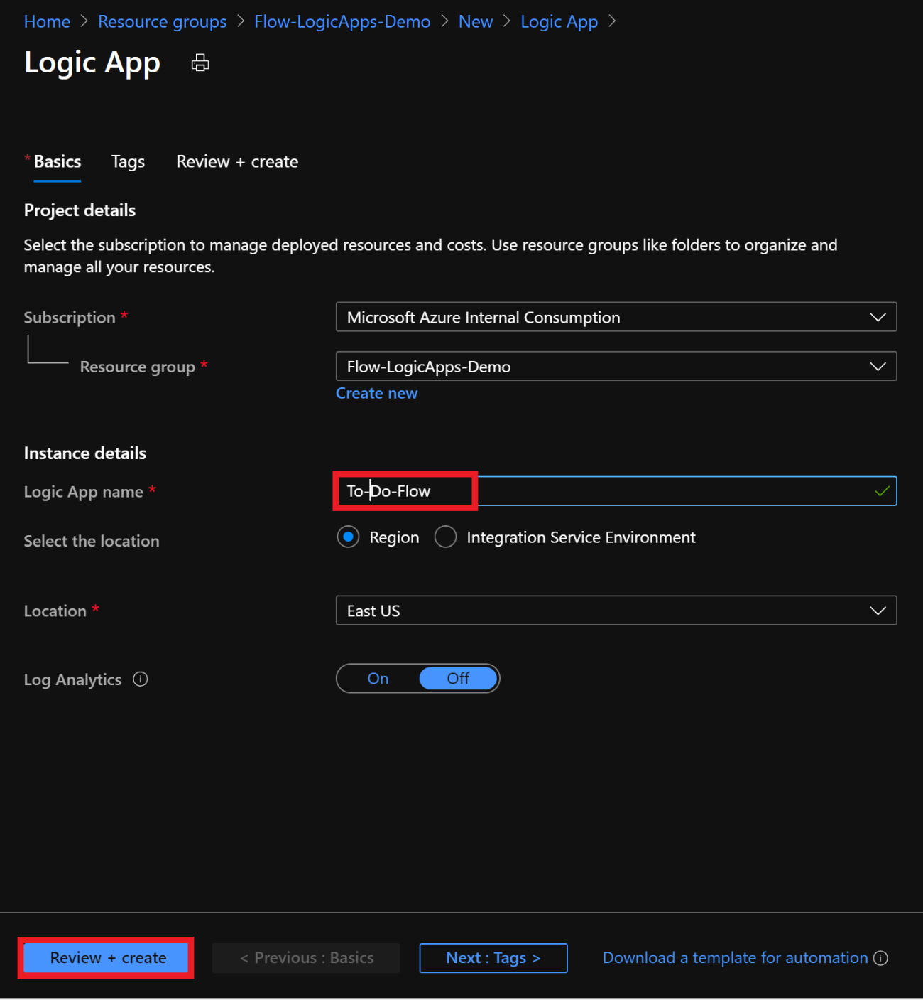

When your Logic app is successfully created, go to your Logic app and choose **Logic app designer**. Select **Recurrence** as a trigger.

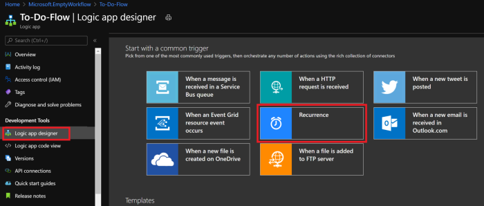

Configure the recurrence as follows:
* **Interval:** `1`
* **Frequecy:** `Day`
* **Timezone:** Select the timezone you prefer
* **Start time:** `YYYY-MM-DD`T`HH:MM:SS`Z
* **At these hours:** `9`

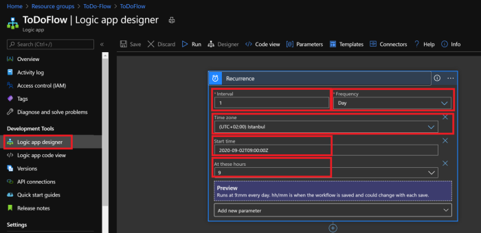

Click plus button, go to **Custom** and choose **To-Do Connector** as a next step and select **Get To-Do Tasks** as an action.

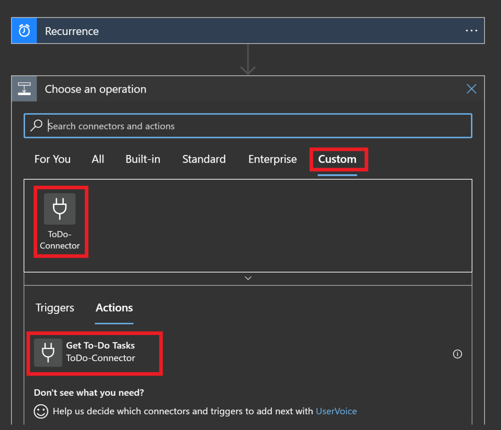

Sign in with the same account you practiced To-Do APIs in the Graph Explorer.

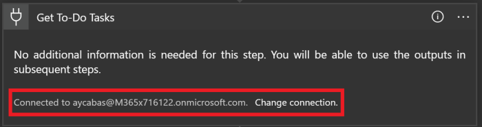

Run the flow and see if you successfully get to-do tasks by using your **Get To-Do Tasks**. Copy the outputs `body`, we will use it in the next step.

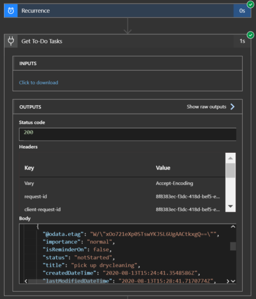

Add **Parse JSON** as a next step. Place **Get To-Do Tasks** `body` under the **Context**. Select **generate schema**, paste the response body you are receiving from the **Get To-Do Tasks** and save.

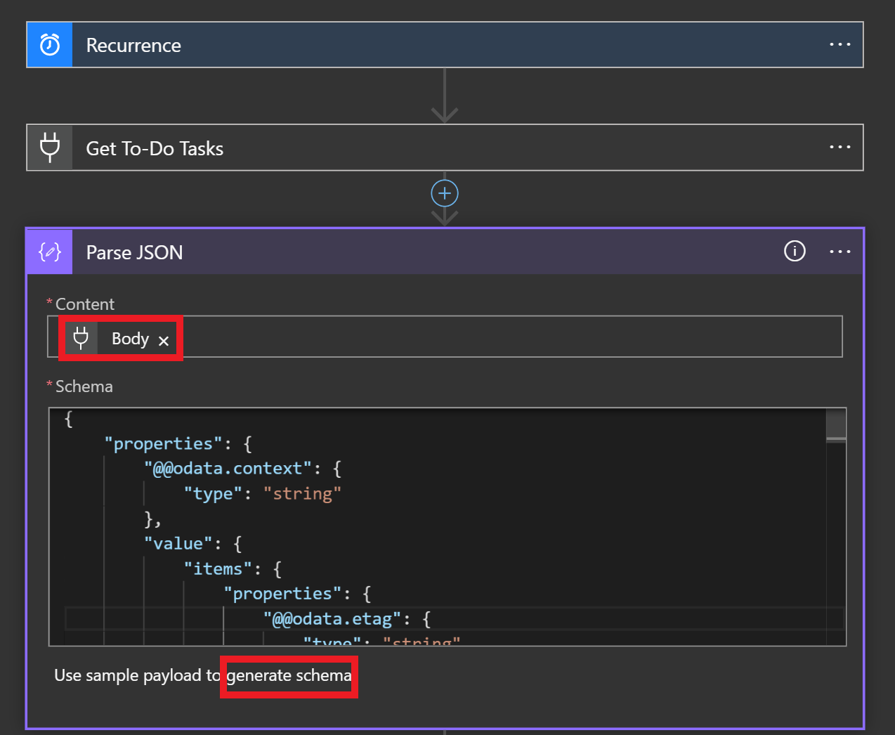

Add **Initialize variable** as a next step. Fill the field as follows:
* **Name:** `Tasks`
* **Type:** `Array`
* **Value:** leave blank

Add **For each** as a next step and fill the fields as follows:
* **output from previous steps:** `value` from the **Parse JSON** step

Add **Compose** in **For each** and fill the fields as follows: 
* **inputs:** `title` from the **Parse JSON** step

Add **Append to array variable** in **For each**, and fill the fields as follows:
* **Name:** `Tasks` 
* **Value:** `Outputs` from the **Compose** step.

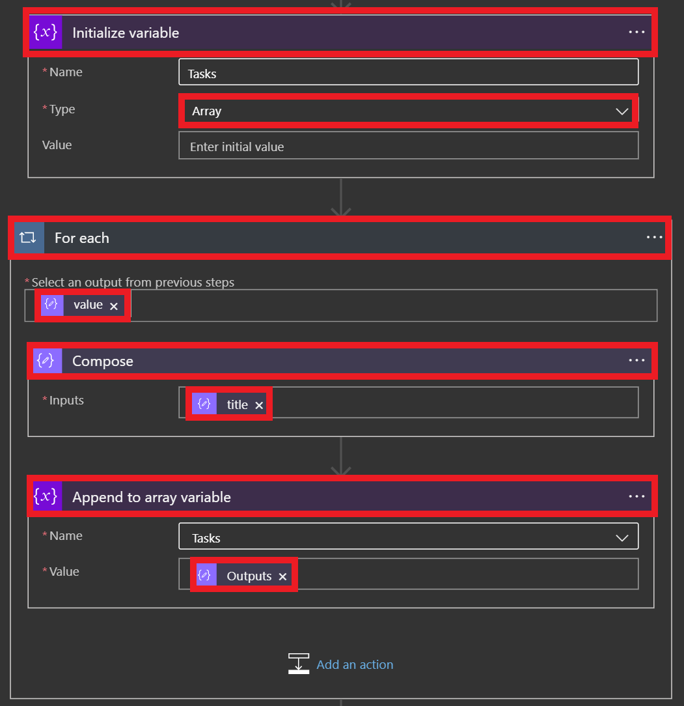

Run the flow and see if To-Do Json response is successfully parsed and all task titles are added in the `Tasks` array.

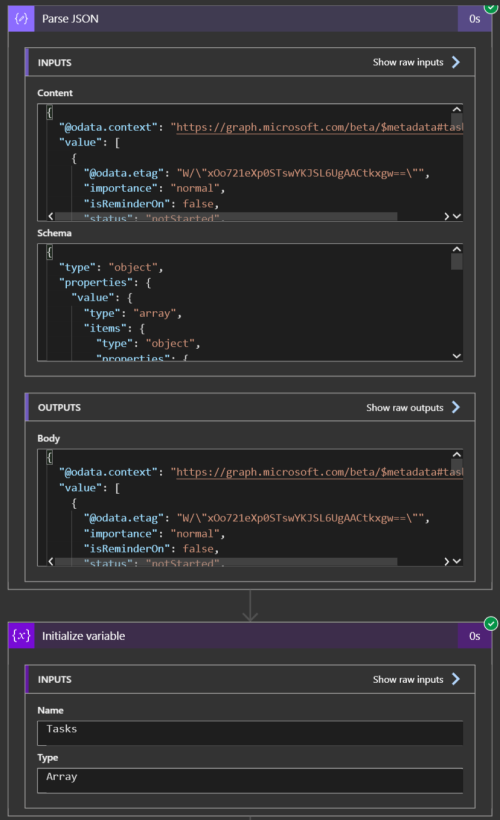
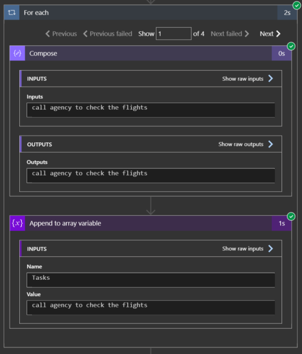

As a next step after **For each**, add **Post a choice of options as the Flow bot to a user** and fill the fields as follows:
* **Options:** `Tasks` from the **Variables** step
* **Headline:** `Good morning!`
* **Receipent:** The same account you consumed the custom connector
* **Message:** `Here is your tasks, have a great day! :)`
* **IsAlert:** `Yes`

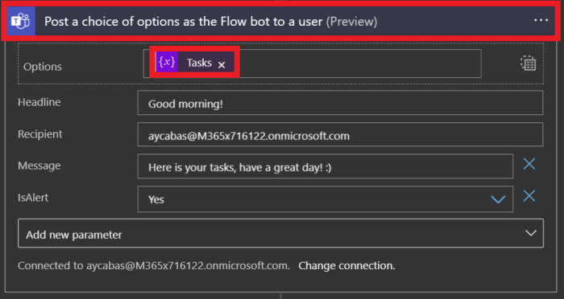

Run the flow and see check [Microsoft Teams](http://teams.microsoft.com/) for the related account if Flow bot is sending a message. Select one of the tasks to see the results in the Logic app flow. 

`Note: If you didn't add Flow in your Microsoft Teams yet, here is the steps to enable Flow in your Teams account: https://cda.ms/1BB`

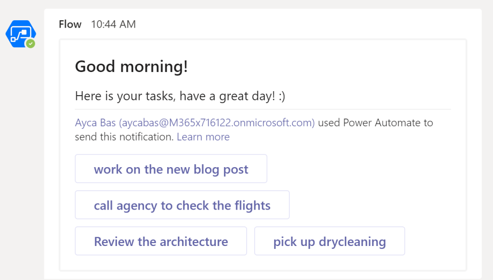
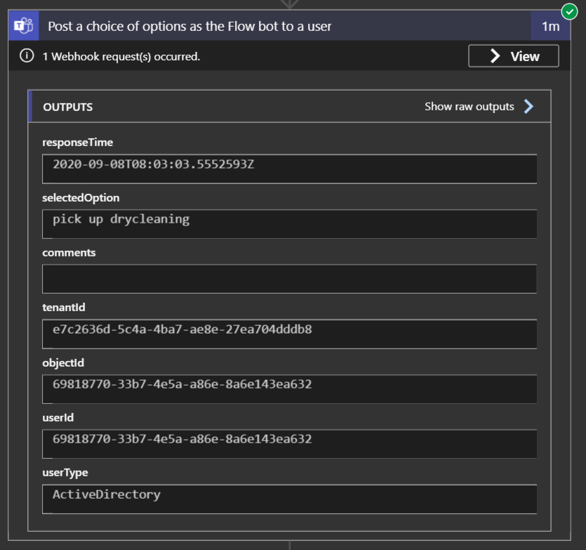

Finally, after user selected any of the tasks to see more details, we will post another card to share more details about the selected option.

Add **For each** after **Post a choice of options as the Flow bot to a user** and fill the fields as follows:
* **Output from previous steps:** `value` from **Parse JSON** step

Add **Condition** in **For each** and fill the fields as follows:
* **Condition:** `And`
* **Choose a value:** `SelectedOption` from the **Post a choice of options as the Flow bot to a user** step
* **Operation:** `equal to`
* **Choose a value:** `title` from **Parse JSON** step

  * **If true:** 
    Add **Post message as a  Flow bot to a user** in true
      * **Headline:** `title` from **Parse JSON** step
      * **Receipent:** The same account you consumed the custom connector
      * **Message:** `importance`. `status`, `createdDateTime` from **ParseJSON** step
      * **IsAlert:** `Yes`
  
  * **If false:** leave blank
      
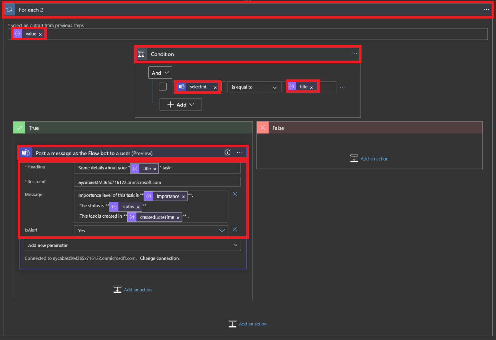

Here is the complete flow. Run the entire flow for testing.

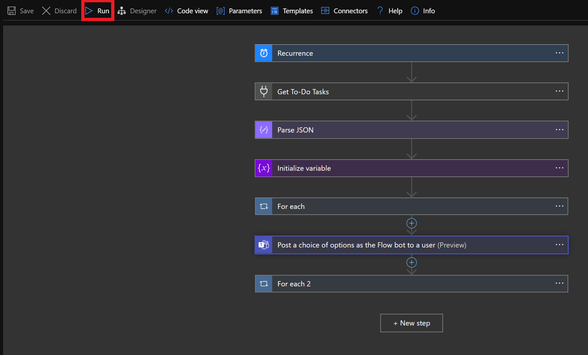

And, the following is going to be the results after selecting one of the tasks to see the details:

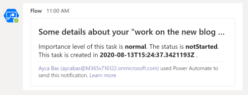
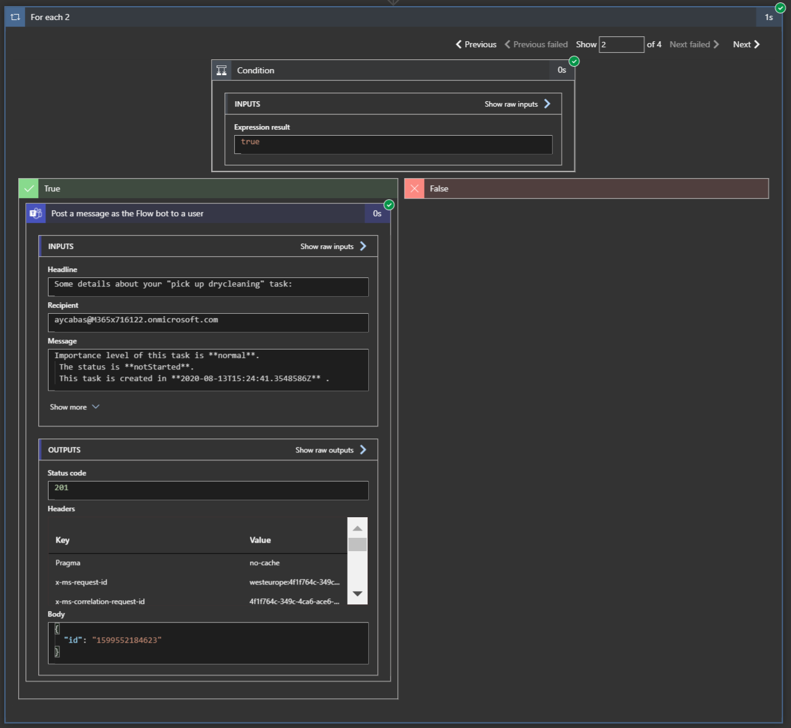

Our flow is completed! You can find the source code below:

Github repository: https://github.com/aycabas/ToDoFlow-LogicApps
Custom Connector: https://github.com/aycabas/ToDoFlow-LogicApps/blob/master/LabFiles/ToDo-Connector.json
Logic Apps flow: https://github.com/aycabas/ToDoFlow-LogicApps/blob/master/LabFiles/ToDo-LogicApps-Flow.json
